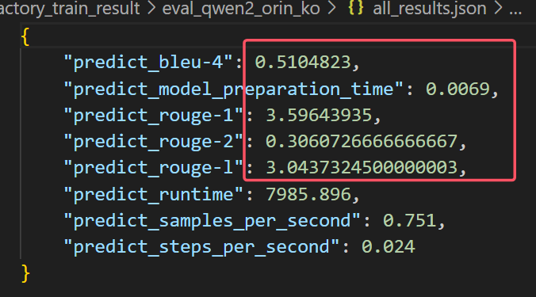
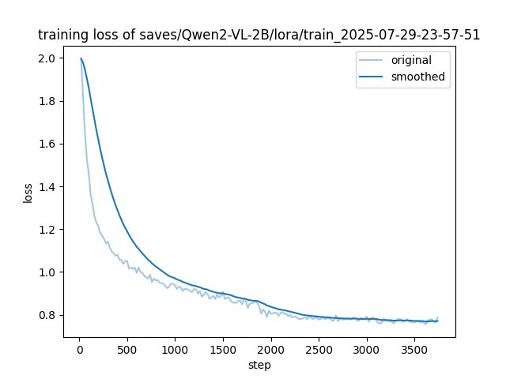
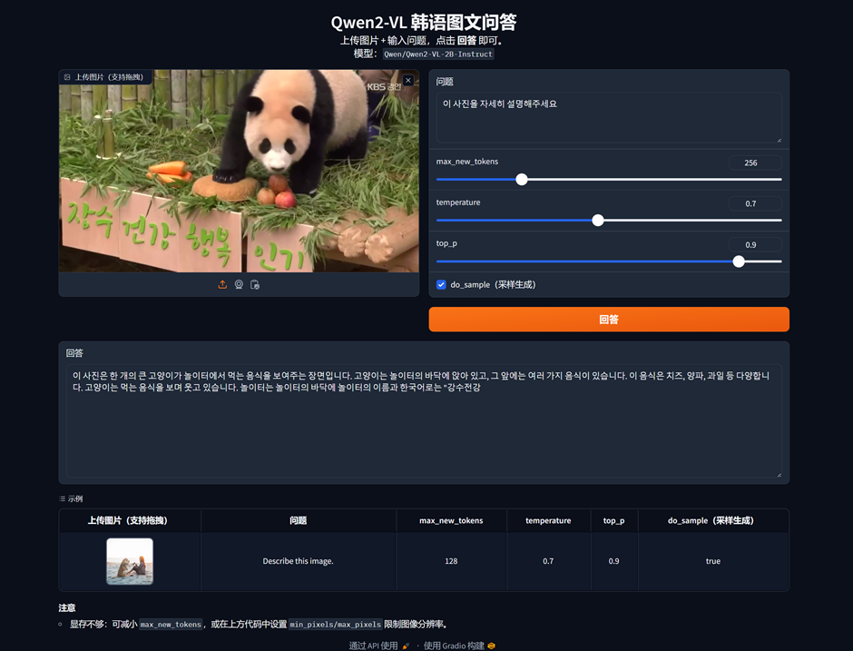
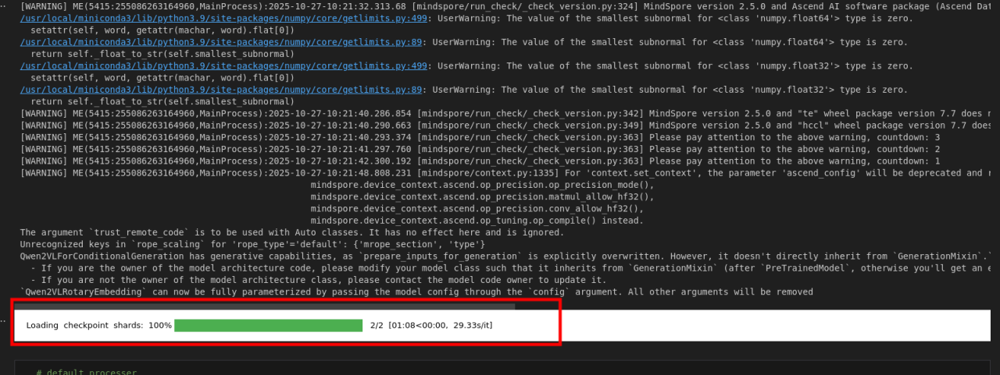
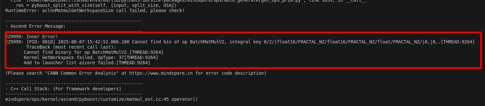

# 🧠Orange-Pi Multimodal Korean  

## 大概微调思路以及出现的问题，希望老师帮忙查看指导一下：
麻烦老师查看一下，思路大概是这样的，（**如果不对或者老师有其他要求可以告知，我会尽快修改**）：

1、下载书生万卷数据集中的韩语（俄语）数据以及基座qwen2-vl-2B模型（都已微调完成）
2、清洗数据，下载原始图片与文本描述
3、转为sharegpt格式，并拆分训练集与测试集
4、利用llamafactory进行lora微调（微调参数以及结果都在文件夹中）
5、评估微调后结果（主要是通过传统nlp里面的bleu、rouge指标）
6、推理测试（有问题，具体在readme中最后一节，之前在mindnlp仓库下面提交issue后也未解决掉）
7、gradio前端界面测试（本地测试，前端页面的示例在readme中）

在实际部署推理时模型可以加载，但是**generate**时底层算子报了错误，麻烦老师查看下整体的**readme**和推理的**ko_test.ipynb**代码，输入编码应该没有问题，也测试了很多CANN和mindspore的不同版本，但是推理过程还是有错误，希望可以指导解决一下，解决后会将所有文档以及代码整理成ipynb文件后重新修改提交

## 基于昇腾 AI 的多模态韩语应用

利用 **“万卷·丝路”** 开源图文语料库，对 **Qwen2-VL-2B或Qwen2.5-VL-3B** 模型在服务器端进行 LoRA 微调图文对话模型，并基于mindspore、mindnlp、CANN和gradio部署于 **OrangePi AIpro**（20 TOPS Ascend SoC）。项目提供：

1. 🖼️+📝**图文联合问答** 微调基于LLamafactory微调
2. 微调后模型在**orangepi aipro**部署

<!-- 相关微调后模型已上传到modelscope：https://www.modelscope.cn/profile/ywsyah -->

> 适用于端侧低资源小语种的昇腾算力 AI 场景。

---

## 🚀 主要特性

| 模块 | 说明 |
| ---- | ---- |
| **底座模型** | `Qwen2-VL-2B-Instruct` / `Qwen2.5-VL-3B-Instruct` |
| **数据集** | [万卷·丝路](https://opendatalab.com/OpenDataLab/WanJuanSiLu2O)（韩语） |
| **训练框架** | LLaMA-Factory 0.9.4.dev0 /  | 
| **部署平台** | OrangePi AIpro（Ascend 20 TOPS，24 GB RAM） |
| **微调方法** | LoRA + SFT |

---

## ⚙️ 环境准备

### 服务器端（训练）

| 硬件 | 规格 |
| ---- | ---- |
| GPU  | NVIDIA A100 80 GB × 1 |
| CPU  | 32 cores |
| RAM  | 224 GB |

| 软件 | 版本 |
| ---- | ---- |
| OS   | Ubuntu 22.04 LTS |
| Python | 3.10 |
| PyTorch | 2.7.2 + CUDA 12.2 |
| Deepspeed | 可选（多卡） |

#### llamafactory安装流程（参考官方github，这里加了国内源）  
    git clone https://github.com/hiyouga/LLaMA-Factory.git
    conda create -n llama_factory python=3.10
    conda activate llama_factory
    cd LLaMA-Factory
    pip install -i https://pypi.tuna.tsinghua.edu.cn/simple -e .[metrics]

---

### Edge 端（OrangePi AIpro）

    MindSpore       2.5.0
    MindNLP         0.4.1
    CANN Toolkit    8.1.RC1.beta1
    Python          3.9
    gradio          4.4.0

---

## 📚 说明
以下训练流程是针对🖼️+📝**图文联合问答** 微调与部署流程（基于LLamafactory微调）应用的。

## 📥 数据集准备与处理

#### 1. 下载”书生万卷“韩语图文标注数据集  

      https://opendatalab.com/OpenDataLab/WanJuanSiLu2O/blob/main/raw/image/ko/ko_image_caption.jsonl

#### 2. 图片拉取与索引重建  

       python scripts/get_all_img.py \
           --input ko_image_caption.jsonl \
           --output ko_caption_clean.json \
           --outdir data/images/ko \
           --max-lines 20000        # 可选：限制下载数量(0代表全部下载)

#### 3. 清洗坏图  

       python scripts/delete_break_img.py \
           --input_json_path ko_caption_clean.json \
           --output_json_path data/ko_sharegpt.json

#### 4. 转换为 ShareGPT 格式  

       python scripts/convert_to_sharegpt.py \
           --input_json_path ko_caption_clean.json \
           --output_json_path data/ko_sharegpt.json

   样例  

       {
         "messages": [
           {"role": "user", "content": "<image>그들은 누구입니까?"},
           {"role": "assistant", "content": "그들은 바이에른 뮌헨의 케인과 고레츠카입니다."},
         ],
         "images": ["demo_data/1.jpg"]
       }

#### 5. 训练 / 测试拆分  

      python split_data.py \
          --src ko_sharegpt.json.json \
          --train_out ko_train.json \
          --eval_out ko_eval.json \
          --n_train 30000 \
          --n_eval 6000

---

## 🔧 微调流程

#### 1. 下载底座模型  

       git lfs install
       git clone https://www.modelscope.cn/Qwen/Qwen2-VL-2B-Instruct.git models/Qwen2-VL-2B-Instruct

#### 2. 添加数据集描述（编辑 `LLaMA-Factory/data/dataset_info.json`）  

       "ko_train": {
         "path": "data/ko_train.json",
         "type": "sharegpt_multi_modal"
       },
       "ko_val": {
         "path": "data/ko_val.json",
         "type": "sharegpt_multi_modal"
       }

#### 3. 启动 WebUI  

       llamafactory-cli webui

#### 4. 关键参数示例(具体参数参考**llamafactory_train_param**文件夹下yaml文件) 

   | 选项 | 值 |
   | ---- | -- |
   | Model name  | Qwen2-VL-2B-Instruct |
   | Model path  | models/Qwen2-VL-2B-Instruct |
   | Finetune    | LoRA |
   | Stage       | Supervised Fine-Tuning |
   | Dataset     | ko_train |
   | Max epochs  | 3 |
   | Batch size  | 16 |
   | Save steps  | 200 |
   | lora_rank   | 64 |
   | lora_alpha  | 128（一般是rank的两倍） |
   | lora_dropout | 0.05（防止过拟合） |
   | Output dir  | saves/Qwen2-VL/lora/Qwen2-VL-sft-ko |

### 5. 监控显存  
       watch -n 1 nvidia-smi

### 6. 训练结果 
   单张 A100 约 **10 h**；最终详细训练结果以及loss曲线见 `llamafactory_train_result`。
   主要通过**Bleu与Rouge**系数评估，训练前后Bleu与Bouge均提升**30%以上**：
   训练前：
   训练后：
   loss曲线
   

---

## 🗜️ 合并 LoRA & 导出

在 WebUI **Expert** 标签执行  

    Model path      = models/Qwen2-VL-2B-Instruct
    Checkpoint path = saves/Qwen2-VL/lora/Qwen2-VL-sft-ko
    Export path     = models/Qwen2-VL-sft-final

点击“开始导出”，得到合并权重。

---

## 📦 边缘端部署（如不需要微调可以直接部署原始的qwen2-vl-2B）
### orangepi aipro环境准备
开发者拿到香橙派开发板后，首先需要进行硬件资源确认，镜像烧录及CANN和MindSpore版本的升级，才可运行该案例，具体如下：

开发板：香橙派Aipro或其他同硬件开发板  
开发板镜像: Ubuntu镜像  
CANN Toolkit/Kernels：8.1.RC1  
MindSpore: 2.6.0  
MindSpore NLP: 0.4.1  
Python: 3.9

### 镜像烧录
运行该案例需要烧录香橙派官网ubuntu镜像，烧录流程参考[昇思MindSpore官网--香橙派开发专区--环境搭建指南--镜像烧录](https://www.mindspore.cn/tutorials/zh-CN/r2.7.0rc1/orange_pi/environment_setup.html) 章节。

### CANN升级
CANN升级参考[昇思MindSpore官网--香橙派开发专区--环境搭建指南--CANN升级](https://www.mindspore.cn/tutorials/zh-CN/r2.7.0rc1/orange_pi/environment_setup.html)章节。

### MindSpore升级
MindSpore升级参考[昇思MindSpore官网--香橙派开发专区--环境搭建指南--MindSpore升级](https://www.mindspore.cn/tutorials/zh-CN/r2.7.0rc1/orange_pi/environment_setup.html)章节。

1. 将 `models/Qwen2-VL-sft-final` 拷贝至 OrangePi AIpro  
2. 参考 `ko_test.ipynb` 进行前端显示与推理测试（实际在orange上部署时出现问题，见下一章节，这里的ko_test是一个测试代码，后续会将gradio.py的内容整合进去）：  
   • 多模态图片问答，前端示例（在本地跑的） 
   

## 报错！！！
#### 先后尝试了
CANN 8.2RC1 + mindnlp0.4.1 + mindspore2.6.0
CANN 8.2RC1 + mindnlp0.4.1 + mindspore2.5.0

CANN 8.1RC1 + mindnlp0.4.1 + mindspore2.6.0
CANN 8.1RC1 + mindnlp0.4.1 + mindspore2.5.0
CANN 8.1RC1beta1 + mindnlp0.4.1 + mindspore2.6.0
CANN 8.1RC1beta1 + mindnlp0.4.1 + mindspore2.5.0

CANN 8.0RC1 + mindnlp0.4.1 + mindspore2.5.0
CANN 8.0RC1 + mindnlp0.4.1 + mindspore2.6.0

#### qwen2_vl模型可以加载，但是在推理时(model.generate)会报错:

#### 之前在mindnlp仓库中提交过issue，说是解决了但是重装后还是有问题，也没有人再回应了：
https://github.com/mindspore-lab/mindnlp/issues/2120

#### 已经在**ko_test.ipynb**中将所有中间结果都打印出来，麻烦老师指导下是推理代码有问题还是底层算子有问题,后续解决后会将所有文档以及代码整理出来重新修改提交。

